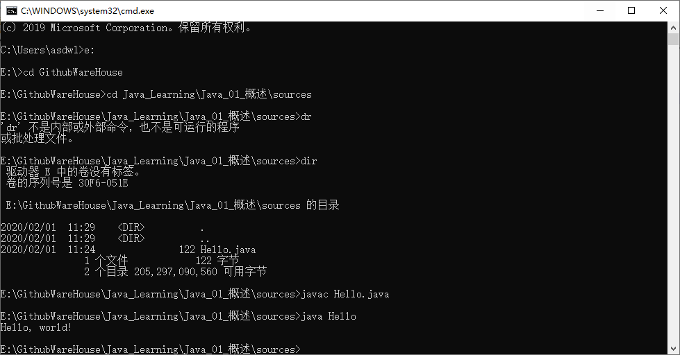

# 概述-Java环境搭建&测试

---

完成时间：2020年2月1日

---


[TOC]

## 软件的定义

软件是一系列按照**特定顺序组织**的计算机**数据**和**指令**的集合。

常见的软件为：

- 系统软件
  - 指代：控制和协调计算机以及外部设备，支持应用软件开发和运行的系统，是无需用户干预的各种 程序的集合。
  - 功能：调度，监控和维护计算机系统，管理计算机系统中的各种独立的硬件，使得他们可以协调工作。
  - DOS Windows Linux
- 应用软件
  - 指代：用户可以使用各种程序设计语言编制的应用程序的集合。
  - 功能：满足用户在不同领域，不同问题的应用需求而提供的那部分软件。
  - Offices 扫雷 迅雷 QQ等


## 人机交互

交互方式：

- 图形化界面（Windows的鼠标操作）

- 命令行界面（Dos的命令操作）

  - 常见的Dos操作命令：

    ```dos
    dir  ：列出文件
    md	 ：创建目录
    rd	 ：删除目录
    cd	 ：进入指定文件
    del	 ：删除文件
    exit ：退出Dos系统
    ```

## Java语言概述

SUN公司于1995年推出的一门高级编程语言;

面向对象编程；

与平台无关；

### Java语言的三种技术架构

- `J2EE(Java 2 Platform Enterprise Edition)`企业版
  - 该技术主要包括`Servlet` `Jsp`技术等，主要针对于Web应用程序开发。
- `J2SE(Java 2 Platform Standard Edition)`标准版
  - 该技术体系是其他两者的基础，可以完成一些桌面应用程序的开发。
- `J2ME(Java 2 Platform Micro Edition)`小型版
  - 主要应用与小型电子产品，如手机中的应用程序等。

### Java特性

- 跨平台性

  - 多平台运行，程序无需改动

  - 原理：在运行`Java`应用程序的操作系统上，先安装一个`JVM(Java Virtual Machine)`，由`JVM`来负责`Java`程序在该系统中的运行。

  - 示意图：

    

## Java编程环境搭建

### `JRE & JDK`

- `JRE(Java Runtime Environment)`
  - Java运行环境：
    - `JVM（Java Virtual Machine）`
    - Java的核心类库
- `JDK(Java Development Kit)`
  - Java开发工具包：
    - 包括`JRE(Java Runtime Environment)`，安装了JDK就不用了安装JRE了
    - 编译工具`javac.exe` 
    - 打包工具：`jar.exe`
    - ...
- 简单来说：使用`JDK`完成`java`程序的开发，然后在使用`JRE`进行程序的运行

### 下载`JDK(Java Development Kit)`

下载地址: [JDK下载地址](https://www.oracle.com/technetwork/java/javase/downloads/jdk8-downloads-2133151.html )


### 配置`java`的环境变量

- 在配置JDK的环境变量时，一般要创建一个新的环境变量`JAVA_HOME`,后续在安装其他环境时会用到这个环境变量
- 使用`%JAVA_HOME%`来动态获取环境变量的值。


- 设置系统环境变量


- 最后：我们在编写`Java`程序时，会调用很多已经写好的包，这些包有自己写的，有`Java`自带的，我们还需要配置路径去寻找这些包。

  

```
变量名：CLASSPATH
变量值：.;%JAVA_HOME%\lib\dt.jar;%JAVA_HOME%\lib\toos.jar
```

### Java环境测试

按快捷键：`win+R`，输入`cmd`:


在`cmd`命令窗口中输入：

- 输入`java`

  

- 输入`javac`

  

- 输入`java -version`

  

  当显示相应结果时，则配置正确

---

## 第一个Java程序编写

新建文本文档，修改名称为：`hello_Java.java`

输入以下内容：

```java
public class Hello {
    public static void main(String[] args) {
        System.out.println("Hello, world!");
    }
}
```

使用命令行进入此目录:

- `javac Hello.java`此时生成字节码文件`Hello.class`
- `java Hello `此时得到程序输出结果



---

`---------------------------------------------END-------------------------------------------------`