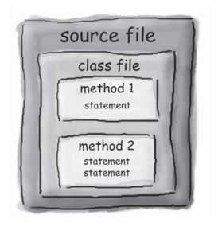
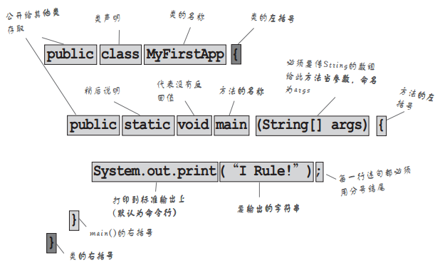
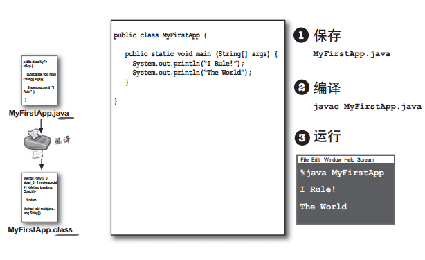
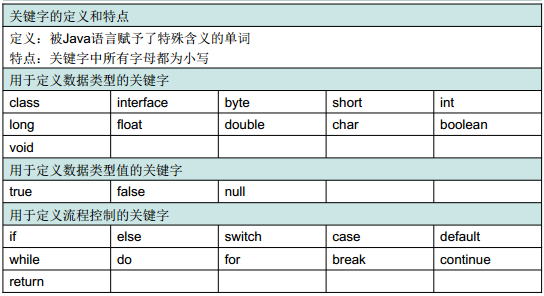
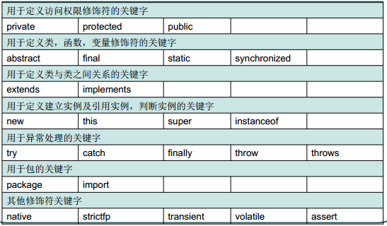
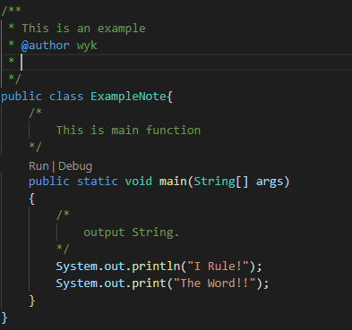
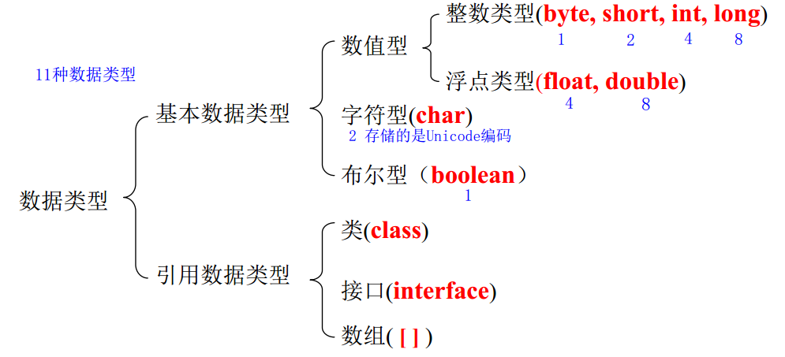
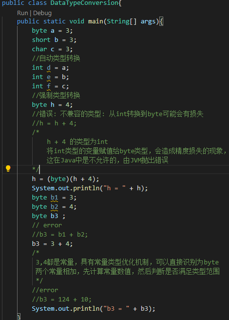
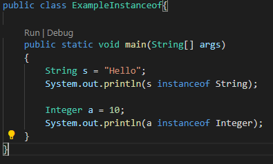
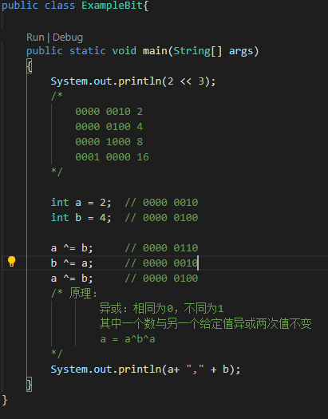

# 基础知识

## Java的程序结构

### Java的程序框架

- 类存在于源文件中
- 方法存在于类中
- 语句存在于方法中



当Java虚拟机启动执行时，JVM会寻找一个特定的方法：

```java
public static void main(String[] args){
    
}
```

**只有这一种写法！！！**

每一个`Java`程序最少有一个类以及`main`方法，每个应用程序只有一个`mian`方法

```java
public class xxx {
    public static void main(String[] args){
        System.out.println("I Rule!");
        System.out.print("Hello Java!!");
    }
}
```

**`println`与`print`的区别在什么地方？**



### Java程序运行



## Java语言组成

### 关键字





### 标志符

1. 数字字母下划线和美元符号

2. 不能以数字开头
3. 不能使用关键字
4. 严格区分大小写

**一些命名规范：**

- 包名：（多单词）全小写
- 类名|接口名：（多单词）首字母大写
- 变量名|函数名：多单词，首字母小写，后续单词的首字母大写
- 常量名：所有字母大写加下划线

### 注释

1. 单行注释 `//`

2. 多行注释`/* xxx */`

3. 文档注释 `/** xxx */`

   可以被JDK的开发工具所识别，生成网页版本的说明文档

4. 先注释在代码

   

### 常量和变量

### 常量

**常量不可改变：**

1. 整数常量
2. 小数常量
3. 布尔常量
4. 字符串常量
5. 字符常量
6. `null`常量

**整数常量有三种表示方法：**

1. 十进制
2. 八进制`0`
3. 十六进制`0x`

### 变量

1. 数据类型 变量名 = 初始值；
2. 变量为内存中的一块区域，其中的数值随着程序的进行而不断的改变其值；
3. 值的范围在数据类型指定的范围内改变；出现错误时，由JVM抛出错误。
4. 变量分为全局变量和局部变量：
   1. 全局变量整个程序内有效
   2. 局部变量只在`{}`内有效



关于`boolean`的内存占用部分：

- 实际上并没有明确的指出占用多大的内存
- 多个`boolean`的情况下，有些编译器会将多个变量安排在一个字节中
- 只有一个`boolean`的话，就占用一个字节

关于`char`的问题：`char`类型为无符号

### 类型转换

- 自动类型转换(隐式类型提升:低级到高级)
  1. `byte` `short` `char` 的值将被提升为int型。
  2. 计算结果向大范围的数据类型提升
     - 如果一个操作数为`long`,计算结果为`long`
  3. 总结：`（byte short char）-> int -> long -> float -> double`

1. 强制类型转化（显示类型提升：高级到低级）
2. 类型转换原理



```java
System.out.println('a');  //'a'
System.out.println('a' + 1);//98
```

### 运算符

#### 算数运算符

```java
+ - * / % ++  -- 字符串“+”（将非字符串转换为字符串）
取整和真正除法的书写方法
```

```java
short s = 3;
//error，执行了两步操作：
//1. 2为int型，s+2为int型
//2. int型赋值给byte型，会造成精度缺失
s = s + 2;
//执行一步操作：等价于 s = (s的类型)（s + 2）;
s += 2;
```

#### 赋值运算符

```java
= += -= /= *= %=
```

#### 比较运算符

```java
== != < > <= >= instanceof(检查是否是类的对象)
```



#### 逻辑运算符

```java
& | !  ^ && ||
&&(短路与)：当前面部分为false时，不判断后面，直接得出结果
||（短路或）：当前面部分为true时，不判断后面，直接得出结果
```

#### 位运算符

```java
<<(左移) >>（右移） >>>（无符号右移） & | ^ ~
```

**异或的特点：**

```java
数据a与数据b异或的结果为c : c = a^b;
此数据c和数据b异或一下又变成了数据a。
a^b^b = a;
b^a^a = b;
```

```java
        int a = 2;  // 0000 0010
        int b = 4;  // 0000 0100

        a = a ^ b;   // a = a ^ b;  
        b = a ^ b;   // b = a^b^b;  此时b的值为a
        a = a ^ b;   // a = a^b^b;
        /* 原理：
                异或：相同为0，不同为1
                其中一个数与另一个给定值异或两次值不变
                a = a^b^b;
        */
```



#### 三元运算符

```java
(Condition)？value1：Value2
```

### 程序流程控制

#### 判断

```java
if ... else if ... else ...
```

#### 选择

```java
switch(){
        case:
    default:
}
```


#### 循环

```java
while(boolean){
    
}
```

```java
do {
    
}while(Condition)
    //最少执行一次
```

```java
for(初始表达式;循环判断条件;循环后的操作表达式){
    执行语句；
}
```

#### 其他

```java
break;
continue;
```

### 函数

### 数组

