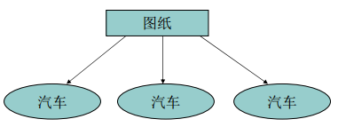
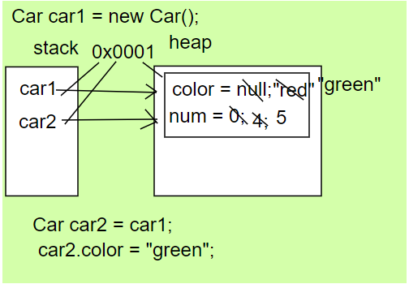
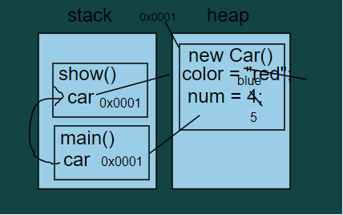
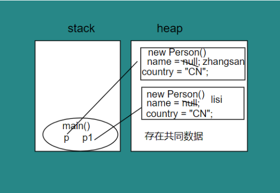
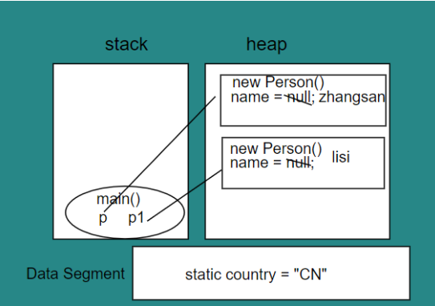
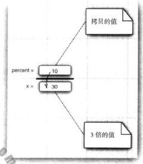
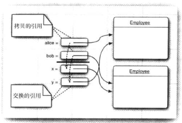

# Java_03_对象和类

> 1. 面向对象程序设计
> 2. 如何创建标准Java类库中的类对象
> 3. 如何编写自己的类

- [Java_03_面向对象](#java_03_面向对象)
  * [面向对象概念](#面向对象概念)
  * [类与对象的关系](#类与对象的关系)
    + [匿名对象](#匿名对象)
  * [封装](#封装)
  * [构造函数](#构造函数)
  * [this关键字](#this关键字)
  * [static关键字](#static关键字)
    + [静态代码块](#静态代码块)
  * [单例设计模式](#单例设计模式)

## 面向对象概念

面向对象程序设计`(Object-Oriented Programming)`

是一种思想：  

- 面向过程（规模较小问题） -> 面向对象（规模较大问题） 
- 面向过程：强调功能
- 面向对象：强调对象，连功能和数据进行封装，强调了功能的对象
- 例子：
  - 一个简单的浏览器程序大约要2000个过程，这些过程需要对一组全局数据进行操作
  - 面向对象只需要100个类，每个类中平均20个方法
  - 便于后期维护和寻找`Bug`

```
人开门; //名次提炼法

人
{
    开门(门)
    {
        门.开；
    }
}


门
{
    开()
    {
        门的细节操作;
        
    }
}
```
- 三个特征：
    - 封装
      - 关键在于不能让类中的方法直接访问其他类中的实例域(对象数据)
      - 黑盒子
    - 继承
      - 自定义类非常容易
      - 可以通过拓展一个类来建立另一个新的类
      - 所有的类 都来自于`Object`类
    - 多态  
- 以后开发就是：找对象 创建对象 使用对象 维护对象

## 类与对象的关系

- 类是对现实生活中的事物的描述，抽取对象中的共性内容，对具体的抽象  
- 对象就是类的实体  



可以这样理解：

- 类就是图纸
- 汽车就是堆内存中的对象

```java
class car {
    /*描述汽车的表面颜色*/
    String color = "red";
    /*描述汽车的轮子个数*/
    int num = 4;
    /*描述汽车的运行状态*/
    void run(){
        System.out.println("car run :" + color + " : " + num);
    }
}
class CarDemo{
    public static void main(String args){
        /*
        Car car1 = null;
        car1 = new Car();
        */
        Car car1 = new Car();
        car1.num = 2;
        //多个引用指向同一个对象
        Car car2 = car1;
        car2.color = "green";
    }
}
```

其内存分析图如下所示：



### 匿名对象

```java
new Car().color = "blue";
new Car().num = 5;
new Car().run();
/*
在这里产生了3个匿名对象实体
*/
```

**总结：**

匿名对象只进行一次方法的调用时，可以使用匿名对象

匿名对象可作为实际参数进行使用

```java
public class Demo{
    public static void main(String[] args){
        Car car = new Car();
        show(car);
        //可使用下面一句替代
        show(new Car())
    }
    public void show(Car car){
        car.color = "blue";
        car.num = 5;
        car.run();
    }
}
```

内存分析如下：栈是从下向上生长的，堆是从上到下生长的



## 封装

封装是指隐藏属性和实现细节，仅对外提供公共访问方式

- 好处：
    - 将变化隔离
    - 便于使用
    - 提高代码重用性
    - 提高安全性
- 封装原则：
    - 将不需要对外提供的内容都隐藏起来
    - 把属性都隐藏，提供公共方法对其访问


| 作用域    | 当前类 | 同包 | 子类 | 其他 |
| --------- | ------ | ---- | ---- | ---- |
| public    | √      | √    | √    | √    |
| protected | √      | √    | √    | ×    |
| default   | √      | √    | ×    | ×    |
| private   | √      | ×    | ×    | ×    |

## 构造函数

函数名与类名相同
不用定义返回值类型
不可以写return语句

作用：
给对象进行初始化

注意：
默认构造函数的特点：
- 当一个类中未定义构造函数时，系统会默认添加
- 当定义了构造函数，系统就不会添加

多个构造函数以重载形式存在


**构造代码块**  

作用：  

给对象进行初始化  

对象已建立就运行，而且优先于构造函数执行  

与构造函数区别：   

构造代码块是给所有对象进行统一初始化    

而构造函数是给对应对象初始化  

## this关键字

this看上去，是用于区分局部变量和成员变量同名的情况  
this为什么可以解决这个问题?  
this到底代表的是什么呢?  
this代表本类对象,到底是哪一个对象?  
    this代表所在函数所属对象的引用  
    简单说，那个对象在调用this所在的函数，this就代表那个对象  
this的应用：当定义类中功能时，该函数内部要用到调用该函数的对象时，这时用this来代表这个对象  


构造函间的调用只能使用this语句
this语句只能放在构造函数的第一句
```java
Person(String name)
{
    this.name = name;
}

Person(String name, int age)
{
    this(name);
    this.age = age;
}
```
## static关键字

```java
/*
	每个人都有名字
	每个人都来自于中国
*/
class Person
{
    String name;
    String country = "CN";
    
    public void show()
    {
        sysout(name + "::" + country);
    }
}
public class Demo
{
    public static void main(String[] args)
    {
        Person p = new Person();
        Person p1 = new Person();
        p.name = "zhangsan ";
        p.show();
        p1.name = "lisi ";
        p1.show();
    }
}
```
内存分析图如下：



**上述代码存在一定的代码冗余的问题，两个实例对象中含有相同的数据，在堆中出现了2次**

解决方法：使用`static`

- 是一个修饰符，用于修饰成员（包括成员函数和成员变量）
- 当成员被修饰的时候，就多了一种调用方式：
  - 类名.(被`static`修饰)成员

上述代码修改版本：

```java
/*
	每个人都有名字
	每个人都来自于中国
*/
class Person
{
    String name; /*成员变量 实例变量*/
    static String country = "CN"; /*静态成员变量 类变量*/
    /*
    	现在：每一个人都有自己的name，这个类的所有实例将共享一个country
    	     即使没有一个人，这个静态变量也是存在的
    	     静态变量属于域而不属于任何独立的对象
    */
    public void show()
    {
        sysout(name + "::" + country);
    }
}
public class Demo
{
    public static void main(String[] args)
    {
        Person p = new Person();
        Person p1 = new Person();
        p.name = "zhangsan ";
        p.show();
        p1.name = "lisi ";
        p1.show();
    }
}
```

内存分析图如下：



通过上述代码修改，可以得知`static`关键字的特点：

- 随着类的加载而加载
    - 说明被`static`修饰的变量的生命周期最长
- 优先于对象而存在
    - 解释了为什么static方法不能调用非static方法
- 被所有对象所共享
    - 解释了为什么非static方法可以调用static方法
- 可以直接被类名调用

实例变量（成员变量）和类变量的区别：
- 存放位置：
    - 类变量 随着类的加载而存在于方法区中
    - 实例变量 随着对象的建立而存放在堆内存中
- 生命周期：
    - 类变量生命周期最长，随着类的消失而消失
    - 实例变量的生命周期随着对象的消失而消失

static的使用注意事项：
- 静态方法只能访问静态成员
- 非静态方法可以访问静态和非静态成员
- 静态方法中不可以定义this/super关键字

static有利有弊
- 利处：
    - 对共享数据进行单独空间的存储，节省空间
    - 可以直接类名调用
- 弊处：
    - 生命周期过长
    - 访问出现局限性

main函数是静态的：
- 主函数是一个特殊的函数，作为程序的入口，被JVM访问
- `public static void main(String[] args)`
    - public ：访问权限最大
    - static ：随着类的加载就已经存在了
    - void   ：主函数无具体返回值
    - main   : 可被JVM识别
    - (String[] args) 参数数组

静态变量使用较少，静态常量使用较多：

```java
class Math{
	public static final double PI = 3.14;
}
//可以直接使用Math.PI;
class Mth {
    //仅仅意味着存储的PI变量中的对象引用在对象构造之后不能被改变
    //并不意味着PI是一个常量
    public final double PI = 3.14;
}
```

```java
public class System{
    public static final PrintStream out = ...;
}
//System.out.xxx
/*
查看JavaSE 8的文档，发现有一个setOut方法，他可以将System.out设置为不同的流
这是因为setOut是一个本地方法，不是用Java语言实现的
*/
```

什么时候使用静态：
- 静态修饰的内容有成员变量和成员函数
- 当数据中出现共享数据是，该数据被静态所修饰
- 对象的特有数据要定义为非静态存放于堆内存中

什么时候使用静态函数：
- 当功能内未访问到非静态数据时，该功能可定义为静态
- 形参不算做访问非静态变量

多文件编辑：
- 只需要编译main函数所在的文件，其他文件JVM会自动寻找

### 工厂模式

静态方法还有一种常见的用途：`NumberFormat`类使用工厂方法产生不同风格的对象

```java
NumberFormat currencyFormat = NumberFormat.getCurrencyFormat();
NumberFormat percentFormat = NumberFormat.percentFormat();
double x = 0.1;
System.out.println(currencyFormat.format(x)); // 0.1
System.out.println(percentFormat.format(x)); // 10%
```

**思考**：为什么不使用构造器来完成这些操作呢？

- 无法命名构造器，编程要求构造器和类名一致
- 当使用构造器时，无法改变所构造的对象类型（稍微有点理解）

### 静态代码块

```java
static 
{
    
}
```
- 随着类的加载而执行，只执行一次,优先于主函数
- 用于给类进行初始化

```java
class test{
    static 
    {
        sout("a");
    }
}
class Demo{
    static{
        sout("b");
    }
    
    public static void main(String[] args)
    {
        new test();
        new test();
    }
    static{
        sout("c");
    }
}

/*执行结果： b c a(只执行一次) */
```

- 对象的初始化过程：
    - new Person 会先找到Person.class文件加载到内存中
    - 执行该类中的static代码块，如果有的话，给Person类进行初始化
    - 在堆中开辟内存，分配内存地址
    - 在堆中建立对象的特有属性，并进行默认初始化
    - 对属性进行显示初始化
    - 对对象进行构造代码块初始化
    - 对对象进行对应的构造函数初始化
    - 将内存地址赋值给栈内存中的变量

## 方法参数

**Java是按值调用的(call by value)**

- 基本类型

```java
public static void main(String[] args){
    double percent = 10;
    tripleValue(percent);
}
public static void tripleValue(double x){
    x = 3 * x;
}
```

示意图：



- 引用类型

```java
public static void tripleValue(Employee x){
    x.raiseSalay(200);
}
public static void main(String[] args){
    harry = new Employee(...);
    tripleValue(harry);
}
```

示意图：


- 验证Java语言是按值调用

```java
public static void swa(Employee x, Employee y){
    Employee temp = x;
    x = y;
    y = temp;
}
public static void main(String[] args){
  	Employee a = new Employee("Alice",xxx);
	Employee b = new Employee("Bob",xxx);
	swap(a,b);  
}

```

示意图：



## 构造方法

### 重载

Java允许任何方法进行重载

重载的特点：

- 返回值不作为重载的一部分
- 函数名相同，参数类型不同

不要进行变量的自动默认初始化；需要进行变量的显示初始化

默认初始化：

- 数值为0
- 布尔值为`false`
- 对象引用为`null`

不明确的初始化会影响程序代码的可读性；

实例变量和局部变量的不同点：

- 必须明确初始化方法中的局部变量
- 实例变量会进行默认初始化

当类中未写构造器时，系统会提供一个无参数构造器；

当类中写了一个有参构造器，调用无参构造器会报错，必须显式的定义


在一个构造器中调用另一个构造器可以使用`this`关键字

```java
class Person {
    private String name;
    private String idcard;
    private int age;
    private String address;
    
    //注释2:生成默认的初始化值
    public Person(){
        
    }
    
    //注释3：
    public Person(String name){
        this.name = name;
    }
    public Person(String name,String idcard){
        this(name); //调用构造函数，公共代码只编写一次
        this.idcard = idcard;
    }
    
}
public static void main(String[] args){
    Person p1 = new Person(); //调用系统提供的无参数构造器，生成合适的初始化值？？？类怎么赋值的？？？ null 还是相应对象的实例
    Person P2 = new Person();//赋予默认值的构造参数见注释2
}
```

### 初始化代码块

三种初始化数据域的方法：

- 使用构造器
- 在声明中赋值
- 初始化代码块

```java
class Person{
    private String name;
    private String idcard;
    private int age;
    private String address;
    private int sex = 0;
    {
        sex = 0;
        age = 22;
    }
    public Person(String name,String idcard){
        this.name = name;
        this.idcard = idcard;
    }
}
```

主函数在实例化对象的时候的代码运行顺序：

- 无论使用那个构造器构造对象，初始化块先于构造器运行
- 这种机制不是必须的，通常将初始化块中的代码放在构造器中

**静态初始化块**

```java
static 
{
    
}
```

- 随着类的加载而加载，只执行一次，且优于主函数
- 用于给类进行初始化

```java
class Test{
    static 
    {
        System.out.println("a");
    }
}
class Demo {
    static 
    {
        System.out.println("a");
    }
    public static void main(String args){
        Test test = new Test();
        System.out.println("c");
    }
}
/*
执行顺序为：b a c(执行一次)
*/
```

**对象的初始化过程：**

1. `new Test`会首先找到`Test.class`文件加载进入内存

2. 执行该类的`static`代码，如果有的话

3. 在堆中开辟内存，分配内存地址

4. 在堆中建立对象的特有属性，并进行默认初始化

5. 对属性进行显式初始化

   ---

6. 对对象进行构造代码块初始化

7. 对对象进行对应的构造函数初始化

8. 将内存地址赋值给栈内存中的变量

### 调用构造器的具体步骤

1. 类变量初始化为默认值
2. 按照在类声明中出现的次序，依次执行所有域初始化语句和初始化块
3. 如果构造器第一行运行了第二个构造器，则执行第二个构造器主题
4. 执行构造器主体

## 单例设计模式

设计模式：主要是解决复杂问题，主要是思想层面的问题。

单例设计模式：

- 内存中只有一个操作对象
- 为了完成上述目的，需要以下步骤：
  1. 禁止其他类创建该对象
     - 构造函数私有化`private Xxx(){}`
  2. 可以让其他类访问创建的对象：
     - 建立私有静态成员变量
       - 私有：使用该类的的实例化方法获得此对象，不能直接操作
       - 静态：因为程序中使用类名.方法来调用&方法为静态方法
       - `private static Xxx xxx =  new Xxx();/*饿汉式*/ ` 
       - `private static Xxx xxx = null;/*懒汉式*/`
  3. 便于其他类的访问，提供一些对外的访问方式
     - 最主要的获取实例对象的方法：
       - `public static Xxx getInstance(){}`

```java
/*饿汉式*/
class Single {
    private Single(){
        
    }   
    private static Single single = new Single();
    public static Single getInstance(){
        return single;
    }
}
public class Demo {
    public static void main(String[] args){
        Single single = Single.getInstance();
    }
}
```

```java
/*懒汉式*/
class Single {
    private Single(){
        
    }
    private static void Single single = null;
    public static Single getInstance(){
        if(single == null)
            single = new single();
        return single;
    }
}
public class Demo {
    public static void main(String[] args){
        Single single = Single.getInstance();
    }
}
```

