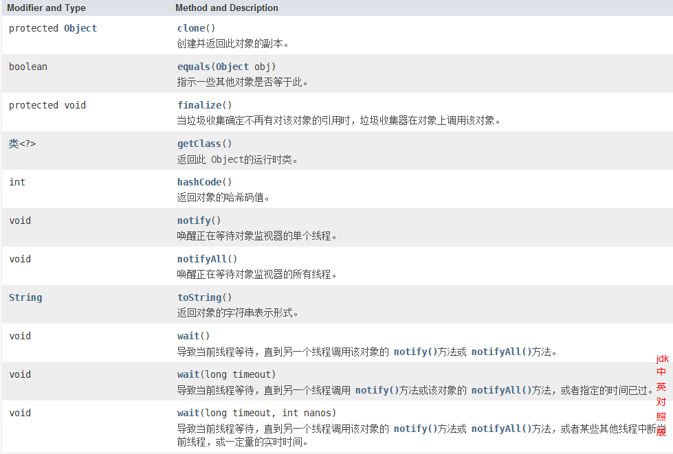

# Object Class

`Class Object` 是Java中所有类的始祖，在Java中每一个类都是由它拓展而来的



## equals方法

`Object.equals`用于检测一个对象是否等于另一个对象。判断两个对象是否具有相同的引用。

`equals`方法的源代码

```java
public Boolean equals(Object obj){
    return this == obj;
}
```

```java
class Demo {
    private int num;
    Demo(int num){
        this.num = num;
    }
    @Override 
    public boolean equals(Object obj){
        /**
         * 确保相比较的是同一个类生成的对象
         */
        if(!(obj instanceof Demo))
            /**
             * 直接返回
             * 或者抛出异常信息
             */
            return false;
        /**
         * 显式声明为Object，此为向上转型
         * 当在函数中需要使用子类的特有数据是，需要向下转型！
         */
        Demo demo = (Demo)obj;
        return this.num == demo.num;
    }
}
class Person {

}

public class ExObject{

    public static void main(String[] args)
    {
        Demo demo1 = new Demo(1);
        Demo demo2 = new Demo(2);
        Demo demo3 = demo1;
        Person person = new Person();
        System.out.println(demo1.equals(demo2));
        System.out.println(demo1.equals(demo3));
        System.out.println(demo1.equals(person));
    }
}
```

## hasCode() 方法

```java
System.out.println(demo1.toString());
   System.out.println(demo1.getClass().getName()+"@"+Integer.toHexString(demo1.hashCode()));
```

一般定义了`equals`方法之后，就必须要定义`hashCode`方法，以便用户可以将对象插入到散列表中。

**主要是针对映射相关的操作！！**

## toString()方法

`JDK`源码：

```java
public String toString() {
        return getClass().getName() + "@" + Integer.toHexString(hashCode());
    }
```

## 泛型数组列表

在C中，在编译时期就必须确定整个数组的大小

```C
int a[size];
//在最新的C99标准中，支持了运行时确定数组大小
int size = xxx;
int a[size];
```

在Java中：

​	允许在运行时确定数组大小，但是并没有完全解决！！

​	一旦定义了数组的大小，就很难改变！！

```java
int size = xx;
int[] arr[size];
```

### ArrayList 类

使用起来像数组，但是在添加或者珊瑚元素的时候，具备自动调节数组容量的功能

```java
ArrayList<int> arr1 = new ArrayList<int>();
ArrayList<int> arr1 = new ArrayList<>();
```

`ArrayList`类的使用：

```java
import java.util.ArrayList;

public class ExArrayList{

    public static void main(String[] args)
    {
        ArrayList<Integer> arrayList1 = new ArrayList<>();
        arrayList1.add(5);
        arrayList1.size();
        /**
         * 下标从0开始
         */
        arrayList1.add(0,1);

        for (int num : arrayList1) {
            System.out.println(num);
        }

        StringBuffer stringBuffer = new StringBuffer();
        stringBuffer.append('H');
        stringBuffer.append('e');
        stringBuffer.append('l');
        stringBuffer.append('l');
        stringBuffer.append('o');
        stringBuffer.append('!');
        /*重写了*/
        String str = stringBuffer.toString();
        System.out.println(str);
    }
}
```

## 对象包装器与自动装箱

`byte short char int long float double boolean` 基本类型

`Byte Short Charact Integer Long Float Double Boolean`基本类型相对应的对象

这些类称之为包装器（wrapper）

```java
//效率低，每一个值要分别包装在对象中
ArrayList<Integer> a = new ArrayList<> ();
a.add(5); //自动装箱
a.add(Integer.valueOf(5));
```

## 枚举enum

```java
public enum Size{SMALL,MEDIUM,LARGE,EXTRA_LARGE};
//实际上，这个声明定义的类型是一个类，他刚好有4个实例
```


# 反射

动态的操控`Java`代码的程序。

