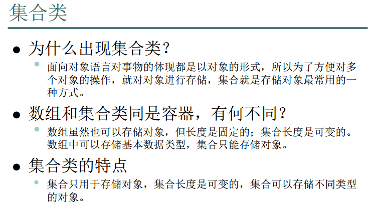
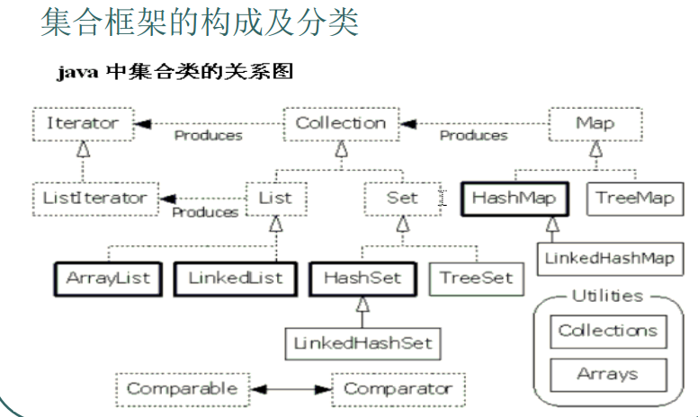
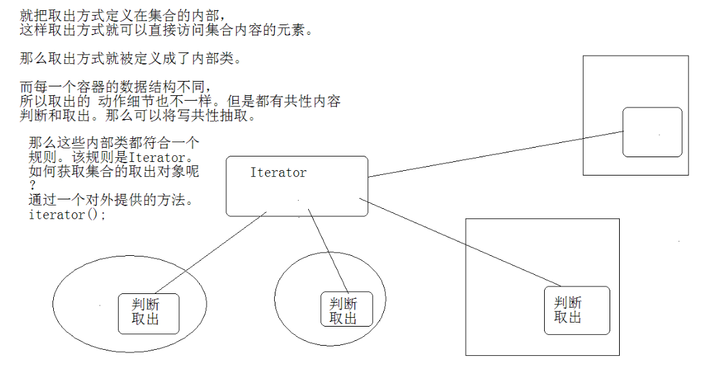

# 集合框架

## 集合类






```java
import java.util.*;

/*
Collection定义了集合框架的共性功能。
1，添加
	add(e);
	addAll(collection);

2，删除
	remove(e);
	removeAll(collection);
	clear();

3，判断。
	contains(e);
	isEmpty();

4，获取
	iterator();
	size();

5，获取交集。
	retainAll();

6，集合变数组。
	toArray();


1，add方法的参数类型是Object。以便于接收任意类型对象。
 
2，集合中存储的都是对象的引用(地址)


什么是迭代器呢？
其实就是集合的取出元素的方式。
如同抓娃娃游戏机中的夹子。

迭代器是取出方式，会直接访问集合中的元素。
所以将迭代器通过内部类的形式来进行描述。
通过容器的iterator()方法获取该内部类的对象。


*/
class  CollectionDemo
{
	public static void main(String[] args) 
	{
		
		method_get();
	}
	public static void method_get()
	{
		ArrayList al = new ArrayList();

		//1，添加元素。
		al.add("java01");//add(Object obj);
		al.add("java02");
		al.add("java03");
		al.add("java04");

		/*
		Iterator it = al.iterator();//获取迭代器，用于取出集合中的元素。

		while(it.hasNext())
		{
			sop(it.next());
		}
		*/

		for(Iterator it = al.iterator(); it.hasNext() ; )
		{
			sop(it.next());
		}
	}


	public static void method_2()
	{
		ArrayList al1 = new ArrayList();

		al1.add("java01");
		al1.add("java02");
		al1.add("java03");
		al1.add("java04");
		ArrayList al2 = new ArrayList();

		al2.add("java03");
		al2.add("java04");
		al2.add("java05");
		al2.add("java06");

		
		//al1.retainAll(al2);//去交集，al1中只会保留和al2中相同的元素。
		al1.removeAll(al2);

		sop("al1:"+al1);
		sop("al2:"+al2);


	}

	public static void base_method()
	{
		//创建一个集合容器。使用Collection接口的子类。ArrayList
		ArrayList al = new ArrayList();

		//1，添加元素。
		al.add("java01");//add(Object obj);
		al.add("java02");
		al.add("java03");
		al.add("java04");

		//打印原集合。
		sop("原集合:"+al);


		//3，删除元素。
		//al.remove("java02");
		//al.clear();//清空集合。


		//4，判断元素。
		sop("java03是否存在:"+al.contains("java03"));
		sop("集合是否为空？"+al.isEmpty());


		//2，获取个数。集合长度。
		sop("size:"+al.size());

		//打印改变后的集合。
		sop(al);

	}

	public static void sop(Object obj)
	{
		System.out.println(obj);
	}
}

```

```java
package collect;

import java.awt.Container;
import java.util.ArrayList;
import java.util.Iterator;

public class TestCollection1 {

	public static void main(String[] args) {
		ArrayList arrayList = new ArrayList();
		arrayList.add("Java01");
		arrayList.add("Java02");
		arrayList.add("Java03");
		arrayList.add("Java04");
		arrayList.add("Java05");
		arrayList.add("Java06");
		
		//1. 取出元素
		Iterator iterator = arrayList.iterator();
		while(iterator.hasNext()) {
			sop(iterator.next());
		}
		
		//2. 取交集
		ArrayList arrayList1 = new ArrayList();
		arrayList1.add("Java01");
		arrayList1.add("Java02");
		ArrayList arrayList2 = new ArrayList();
		arrayList2.add("Java01");
		arrayList2.add("Java02");
		arrayList2.add("Java03");
		arrayList2.add("Java04");
		arrayList2.retainAll(arrayList1);
		sop(arrayList2);
		// 3. 获取集合长度
		sop(arrayList.size());
		//4.查询操作
		sop(arrayList.contains("Java01"));
		
		
		
	}
	public static void sop(Object object) {
		System.out.println(object);
	}

}

```

## 关于迭代器的设计问题



使用内部类和接口进行实现：

- 内部类便于访问外部类成员变量
  - 取出方式被定义为了内部类
- 基本上所有的集合体系全部具有迭代器
  - 由于数据结构不一样
  - 取出动作不一样
  - 将其共性进行抽取，得到其迭代器接口

## List集合

```java
/*
Collection
	|--List:元素是有序的，元素可以重复。因为该集合体系有索引。
		|--ArrayList:底层的数据结构使用的是数组结构。特点：查询速度很快。但是增删稍慢。线程不同步。
		|--LinkedList:底层使用的链表数据结构。特点：增删速度很快，查询稍慢。线程不同步。
		|--Vector:底层是数组数据结构。线程同步。被ArrayList替代了。因为效率低。


	|--Set：元素是无序，元素不可以重复。、


List：
	特有方法。凡是可以操作角标的方法都是该体系特有的方法。

增
	add(index,element);
	addAll(index,Collection);

删
	remove(index);

改
	set(index,element);
查
	get(index):
	subList(from,to);
	listIterator();
	int indexOf(obj):获取指定元素的位置。
	ListIterator listIterator();


List集合特有的迭代器。ListIterator是Iterator的子接口。

在迭代时，不可以通过集合对象的方法操作集合中的元素。
因为会发生ConcurrentModificationException异常。

所以，在迭代器时，只能用迭代器的放过操作元素，可是Iterator方法是有限的，
只能对元素进行判断，取出，删除的操作，
如果想要其他的操作如添加，修改等，就需要使用其子接口，ListIterator。

该接口只能通过List集合的listIterator方法获取。

*/


import java.util.*;
class ListDemo 
{
	public static void sop(Object obj)
	{
		System.out.println(obj);
	}
	public static void method()
	{
		
		ArrayList al = new ArrayList();

		//添加元素
		al.add("java01");
		al.add("java02");
		al.add("java03");
		
		sop("原集合是："+al);
		//在指定位置添加元素。
		al.add(1,"java09");

		//删除指定位置的元素。
		//al.remove(2);

		//修改元素。
		//al.set(2,"java007");

		//通过角标获取元素。
		sop("get(1):"+al.get(1));

		sop(al);

		//获取所有元素。
		for(int x=0; x<al.size(); x++)
		{
			System.out.println("al("+x+")="+al.get(x));
		}

		Iterator it = al.iterator();

		while(it.hasNext())
		{
			sop("next:"+it.next());
		}


		//通过indexOf获取对象的位置。
		sop("index="+al.indexOf("java02"));

		List sub = al.subList(1,3);

		sop("sub="+sub);
	}

	
	public static void main(String[] args) 
	{

		//演示列表迭代器。
		ArrayList al = new ArrayList();

		//添加元素
		al.add("java01");
		al.add("java02");
		al.add("java03");

		sop(al);

		
		ListIterator li = al.listIterator();

		
		//sop("hasPrevious():"+li.hasPrevious());

		while(li.hasNext())
		{
			Object obj = li.next();

			if(obj.equals("java02"))
				//li.add("java009");
				li.set("java006");


		}

		while(li.hasPrevious())
		{
			sop("pre::"+li.previous());
		}
		//sop("hasNext():"+li.hasNext());
		//sop("hasPrevious():"+li.hasPrevious());


		sop(al);


		/*
		//在迭代过程中，准备添加或者删除元素。

		Iterator it = al.iterator();

		while(it.hasNext())
		{
			Object obj = it.next();

			if(obj.equals("java02"))
				//al.add("java008");
				it.remove();//将java02的引用从集合中删除了。

			sop("obj="+obj);


		}
		sop(al);
		*/
		


	}
}

```

```java
package collect;

import java.util.ArrayList;
import java.util.Iterator;
import java.util.ListIterator;

/**
 * ArrayList 的用法：
 * 	1. 简单的增删改查
 * 
 * @author asdw1
 *
 */

public class TestCollection2 {

	public static void main(String[] args) {
		// TODO Auto-generated method stub
		method2();
		
	}
	
	public static void method1() {
		ArrayList arr1 = new ArrayList();
		//1.1增加
		arr1.add("Java01");
		arr1.add("Java02");
		arr1.add("Java03");
		arr1.add("Java04");
		arr1.add("Java05");
		//1.2添加
		arr1.add(1,"Java09");
		
		//1.3删除
		arr1.remove(2);
		//1.4修改
		arr1.set(4, "Java05");
		//1.5 通过角标获取元素
		System.out.println(arr1.get(4));
		
		//1.6 获取所有元素
		for(int i = 0; i < arr1.size(); i++){
			System.out.println(arr1.get(i));
		}
		//1.7使用迭代器获取元素
		Iterator it = arr1.iterator();
		while(it.hasNext()) {
			System.out.println(it.next());
		}
		//1.8 获取对象位置
		System.out.println("index = " + arr1.indexOf("Java09"));
	}
	
	public static void method2() {
		
		ArrayList arr1 = new ArrayList();
		//1.1增加
		arr1.add("Java01");
		arr1.add("Java02");
		arr1.add("Java03");
		arr1.add("Java04");
		arr1.add("Java05");
		
		//2 迭代器的局限性
		/**
		 * java.util.ConcurrentModificationException
		 * 当不允许这样的修改时，可以通过检测到对象的并发修改的方法来抛出此异常。 
		 * 例如，一个线程通常不允许修改集合，而另一个线程正在遍历它。 
		 * 一般来说，在这种情况下，迭代的结果是未定义的。 
		 * 某些迭代器实现（包括由JRE提供的所有通用集合实现的实现）
		 * 可能会选择在检测到此行为时抛出此异常。  
		 */
		Iterator it = arr1.iterator();
		while (it.hasNext()) {
			System.out.println(it.next());
			//error 
			//简单来说，就是迭代器在迭代之前就已经确认了集合中的元素了
			//你现在增减元素，属于多线程操作
			//你可以实现移除操作！！，这属于同线程操作！！
			//arr1.add(1,"Java06");
			
		}
		//List元素的特有迭代器
		//因为带有角标！！
		ListIterator lit = arr1.listIterator();
		while(lit.hasNext()) {
			
			Object object = lit.next();
			if(object.equals("Java02")) {
				lit.set("Java03");
			}
		}
		
		System.out.println(arr1);
	}

}

```

### LinkList的特有方法

```java
import java.util.*;

/*
LinkedList:特有方法：
addFirst();
addLast();

getFirst();
getLast();
获取元素，但不删除元素。如果集合中没有元素，会出现NoSuchElementException

removeFirst();
removeLast();
获取元素，但是元素被删除。如果集合中没有元素，会出现NoSuchElementException


在JDK1.6出现了替代方法。

offerFirst();
offerLast();


peekFirst();
peekLast();
获取元素，但不删除元素。如果集合中没有元素，会返回null。

pollFirst();
pollLast();
获取元素，但是元素被删除。如果集合中没有元素，会返回null。


*/

class LinkedListDemo 
{
	public static void main(String[] args) 
	{
		LinkedList link = new LinkedList();

		link.addLast("java01");
		link.addLast("java02");
		link.addLast("java03");
		link.addLast("java04");

		//sop(link);
//		sop(link.getFirst());
//		sop(link.getFirst());
		//sop(link.getLast());
		//sop(link.removeFirst());
		//sop(link.removeFirst());

		//sop("size="+link.size());

		while(!link.isEmpty())
		{
			sop(link.removeLast());
		}

	}

	public static void sop(Object obj)
	{
		System.out.println(obj);
	}
}
/*

---
java01
java02
java03
java04

----
java04
java03
java02
java01
---
*/
```

```java
/*
使用LinkedList模拟一个堆栈或者队列数据结构。

堆栈：先进后出  如同一个杯子。
队列：先进先出 First in First out  FIFO 如同一个水管。


*/

import java.util.*;
class DuiLie
{
	private LinkedList link;

	DuiLie()
	{
		link = new LinkedList();
	}
	
	public void myAdd(Object obj)
	{
		link.addFirst(obj);
	}
	public Object myGet()
	{
		return link.removeFirst();
	}
	public boolean isNull()
	{
		return link.isEmpty();
	}

}


class  LinkedListTest
{
	public static void main(String[] args) 
	{
		DuiLie dl = new DuiLie();
		dl.myAdd("java01");
		dl.myAdd("java02");
		dl.myAdd("java03");
		dl.myAdd("java04");

		while(!dl.isNull())
		{
			System.out.println(dl.myGet());
		}
	}
}

```

```java
import java.util.*;

/*
去除ArrayList集合中的重复元素。

*/

class ArrayListTest 
{

	public static void sop(Object obj)
	{
		System.out.println(obj);
	}
	public static void main(String[] args) 
	{
		ArrayList al = new ArrayList();

		al.add("java01");
		al.add("java02");
		al.add("java01");
		al.add("java02");
		al.add("java01");
//		al.add("java03");


		/*
		在迭代时循环中next调用一次，就要hasNext判断一次。
		Iterator it = al.iterator();

		while(it.hasNext())
		{
			sop(it.next()+"...."+it.next());
		}
		*/

		/**/
		sop(al);
		
		al = singleElement(al);

		sop(al);
		

	}

	public static ArrayList singleElement(ArrayList al)
	{
		//定义一个临时容器。
		ArrayList newAl = new ArrayList();

		Iterator it = al.iterator();

		while(it.hasNext())
		{
			Object obj = it.next();

			if(!newAl.contains(obj))
				newAl.add(obj);

		}

		return newAl;
	}
}

```

```java

import java.util.*;

/*
将自定义对象作为元素存到ArrayList集合中，并去除重复元素。

比如：存人对象。同姓名同年龄，视为同一个人。为重复元素。


思路：
1，对人描述，将数据封装进人对象。
2，定义容器，将人存入。
3，取出。


List集合判断元素是否相同，依据是元素的equals方法。


*/


class Person
{
	private String name;
	private int age;
	Person(String name,int age)
	{
		this.name = name;
		this.age = age;
	}
	
	public boolean equals(Object obj)
	{

		if(!(obj instanceof Person))
			return false;

		Person p = (Person)obj;
		//System.out.println(this.name+"....."+p.name);

		return this.name.equals(p.name) && this.age == p.age;
	}
	/**/
	public String getName()
	{
		return name;
	}
	public int getAge()
	{
		return age;
	}
}
class ArrayListTest2 
{
	public static void sop(Object obj)
	{
		System.out.println(obj);
	}
	public static void main(String[] args) 
	{
		ArrayList al = new ArrayList();

		al.add(new Demo());

		al.add(new Person("lisi01",30));//al.add(Object obj);//Object obj = new Person("lisi01",30);
		//al.add(new Person("lisi02",32));
		al.add(new Person("lisi02",32));
		al.add(new Person("lisi04",35));
		al.add(new Person("lisi03",33));
		//al.add(new Person("lisi04",35));

		
		//al = singleElement(al);

		sop("remove 03 :"+al.remove(new Person("lisi03",33)));//remove方法底层也是依赖于元素的equals方法。


		Iterator it = al.iterator();


		while(it.hasNext())
		{
			Person p = (Person)it.next();
			sop(p.getName()+"::"+p.getAge());
		}
	}


	public static ArrayList singleElement(ArrayList al)
	{
		//定义一个临时容器。
		ArrayList newAl = new ArrayList();

		Iterator it = al.iterator();

		while(it.hasNext())
		{
			Object obj = it.next();

			if(!newAl.contains(obj))
				newAl.add(obj);

		}

		return newAl;
	}
}

```

```java
package collect;

import java.util.ArrayList;
import java.util.Iterator;

class Person {
	private String name;
	private int age;
	public Person(String name, int age) {
		super();
		this.name = name;
		this.age = age;
	}
	public String getName() {
		return name;
	}
	public void setName(String name) {
		this.name = name;
	}
	public int getAge() {
		return age;
	}
	public void setAge(int age) {
		this.age = age;
	}
	@Override
	public String toString() {
		return "Person [name=" + name + ", age=" + age + "]";
	}
	public boolean equals(Object obj) {
		if(!(obj instanceof Person)) {
			return false;
		}
		Person person = (Person)obj;
		return this.age == person.age;
	}
	
}


public class TestCollection4 {

	public static void main(String[] args) {
		// TODO Auto-generated method stub
		ArrayList arrayList = new ArrayList();
		arrayList.add(new Person("aa",31));
		arrayList.add(new Person("bb",32));
		arrayList.add(new Person("cc",33));
		arrayList.add(new Person("aa",31));
		arrayList.add(new Person("bb",32));
		arrayList.add(new Person("cc",33));
		System.out.println("前：");
		for (int i = 0; i < arrayList.size(); i++) {
			System.out.println(arrayList.get(i).toString());
		}
		System.out.println("后：");
		arrayList = singleElement(arrayList);
		for (int i = 0; i < arrayList.size(); i++) {
			System.out.println(arrayList.get(i).toString());
		}
		
		
	}
	public static ArrayList singleElement(ArrayList arr) {
		ArrayList newarr = new ArrayList();
		Iterator it = arr.iterator();
		while(it.hasNext()) {
			Object object = it.next();
			if(!newarr.contains(object)) {
				newarr.add(object);
			}
		}
		return newarr;
	}
}

```

## set

```java
import java.util.*;
/*
|--Set：元素是无序(存入和取出的顺序不一定一致)，元素不可以重复。、
	|--HashSet:底层数据结构是哈希表。是线程不安全的。不同步。
			HashSet是如何保证元素唯一性的呢？
			是通过元素的两个方法，hashCode和equals来完成。
			如果元素的HashCode值相同，才会判断equals是否为true。
			如果元素的hashcode值不同，不会调用equals。

			注意,对于判断元素是否存在，以及删除等操作，依赖的方法是元素的hashcode和equals方法。


	|--TreeSet：

Set集合的功能和Collection是一致的。
*/


class HashSetDemo 
{
	public static void sop(Object obj)
	{
		System.out.println(obj);
	}
	public static void main(String[] args) 
	{
		
		HashSet hs = new HashSet();

		sop(hs.add("java01"));
		sop(hs.add("java01"));
		hs.add("java02");
		hs.add("java03");
		hs.add("java03");
		hs.add("java04");

		Iterator it = hs.iterator();

		while(it.hasNext())
		{
			sop(it.next());
		}
	}
}

```

```java
package collect;

import java.util.HashSet;
import java.util.Iterator;

/**
 * HashSet的用法
 * 	1. 为什么.add方法返回的值是boolean型？
 * 		是为了判定是否存入了集合中
 * 	2. HashSet如何判断重复元素？
 * 		2.1 通过判断哈希值来来判断是否还有重复值
 * 			元素的存储方法是按照哈希值的大小从上到下进行排序的
 * 			可能与存入集合的顺序不一致
 * 		2.2 当哈希值一样是，通过判断对象是否一样来判断石佛市同一个对象（equals）
 * 		2.3 当哈希值一致时，且对象不一致是，会在后面进行顺延
 * 
 * @author asdw1
 *
 */

public class TestCollection5 {

	public static void main(String[] args) {
		// TODO Auto-generated method stub
		HashSet ha = new HashSet();
		System.out.println(ha.add("Java01"));
		System.out.println(ha.add("Java01"));
		ha.add("Java02");
		ha.add("Java03");
		ha.add("Java04");
		ha.add("Java04");
		
		Iterator it = ha.iterator();
		while(it.hasNext()) {
			System.out.println(it.next());
		}
	}

}

```

```java
package collect;

import java.util.HashSet;
import java.util.Iterator;

/**
 * HashSet存储自定义对象
 * @author asdw1
 *
 */
class Person1 {
	private String name;
	private int age;
	public Person1(String name, int age) {
		super();
		this.name = name;
		this.age = age;
	}
	public String getName() {
		return name;
	}
	public void setName(String name) {
		this.name = name;
	}
	public int getAge() {
		return age;
	}
	public void setAge(int age) {
		this.age = age;
	}
	@Override
	public int hashCode() {
		System.out.println("HashCode...");
		return this.name.hashCode() + age*37;
	}
	@Override
	public String toString() {
		return "Person1 [name=" + name + ", age=" + age + "]";
	}
	
	@Override 
	public boolean equals(Object object) {
		if(!(object instanceof Person1)) {
			return false;
		}
		Person1 person1 = (Person1)object;
		return this.name.equals(person1.name) && this.age == person1.age;
	}
}

public class TestCollection6 {

	public static void main(String[] args) {
		// TODO Auto-generated method stub
		HashSet ha = new HashSet();
		ha.add(new Person1("a1", 21));
		ha.add(new Person1("a2", 22));
		ha.add(new Person1("a3", 23));
		ha.add(new Person1("a1", 21));
		
		for(Iterator it = ha.iterator(); it.hasNext();) {
			System.out.println(it.next().toString());
		}
	}
}

```

### TreeSet

```java
import java.util.*;

/*
Set:无序，不可以重复元素。
	|--HashSet：数据结构是哈希表。线程是非同步的。
				保证元素唯一性的原理：判断元素的hashCode值是否相同。
				如果相同，还会继续判断元素的equals方法，是否为true。

	|--TreeSet：可以对Set集合中的元素进行排序。
				底层数据结构是二叉树。
				保证元素唯一性的依据：
				compareTo方法return 0.

				TreeSet排序的第一种方式：让元素自身具备比较性。
				元素需要实现Comparable接口，覆盖compareTo方法。
				也种方式也成为元素的自然顺序，或者叫做默认顺序。

				TreeSet的第二种排序方式。
				当元素自身不具备比较性时，或者具备的比较性不是所需要的。
				这时就需要让集合自身具备比较性。
				在集合初始化时，就有了比较方式。
需求：
往TreeSet集合中存储自定义对象学生。
想按照学生的年龄进行排序。


记住，排序时，当主要条件相同时，一定判断一下次要条件。


*/

class TreeSetDemo 
{
	public static void main(String[] args) 
	{
		TreeSet ts = new TreeSet();

		ts.add(new Student("lisi02",22));
		ts.add(new Student("lisi007",20));
		ts.add(new Student("lisi09",19));
		ts.add(new Student("lisi08",19));
		//ts.add(new Student("lisi007",20));
		//ts.add(new Student("lisi01",40));

		Iterator it = ts.iterator();
		while(it.hasNext())
		{
			Student stu = (Student)it.next();
			System.out.println(stu.getName()+"..."+stu.getAge());
		}
	}
}


class Student implements Comparable//该接口强制让学生具备比较性。
{
	private String name;
	private int age;

	Student(String name,int age)
	{
		this.name = name;
		this.age = age;
	}

	public int compareTo(Object obj)
	{

		//return 0;
		
		if(!(obj instanceof Student))
			throw new RuntimeException("不是学生对象");
		Student s = (Student)obj;

		System.out.println(this.name+"....compareto....."+s.name);
		if(this.age>s.age)
			return 1;
		if(this.age==s.age)
		{
			return this.name.compareTo(s.name);
		}
		return -1;
		/**/
	}

	public String getName()
	{
		return name;

	}
	public int getAge()
	{
		return age;
	}
}
```

```java
package collect;

import java.util.Comparator;
import java.util.Iterator;
import java.util.TreeSet;

/**
 * TreeSet的使用方法
 * 	1. 往TreeSet集合中直接添加一个元素时，不显示错误
 * 	2. 往TreeSet集合中添加多余一个元素时，会显示错误cannot be cast to java.lang.Comparable
 * 		原因：TreeSet为树型结构，Person2类无法进行排序比较
 * 	3. 当强制让人具有比较性之后：
 * 		原顺序输出：返回1
 * 		逆顺序输出：返回-1
 * 4. 方法3，使用的是类对象的内置比较器，如果我们想要按照不同的要求进行排序，则需要修改类本身的内容
 * 		拓展性太差，因此出现了方法5
 * 5. 使用外置类，实现了Comparator接口中的compare方法
 * 		当两种方法同时存在是，优先外置比较方法
 * @author asdw1
 *
 */
class MyCompare implements Comparator {
	public int compare(Object object1,Object object2) {
		if(!(object1 instanceof Person2))
			throw new RuntimeException("非本类对象...");
		if(!(object2 instanceof Person2))
			throw new RuntimeException("非本类对象...");
		Person2 person21 = (Person2)object1;
		Person2 person22 = (Person2)object2;
		int num = person21.getName().compareTo(person22.getName());
		if(num == 0){
			return new Integer(person21.getAge()).compareTo(new Integer(person22.getAge()));
		}
		return num;
	}
}
class Person2 implements Comparable {
	private String name;
	private int age;
	public Person2(String name, int age) {
		super();
		this.name = name;
		this.age = age;
	}
	public String getName() {
		return name;
	}
	public void setName(String name) {
		this.name = name;
	}
	public int getAge() {
		return age;
	}
	public void setAge(int age) {
		this.age = age;
	}
	@Override
	public String toString() {
		return "Person1 [name=" + name + ", age=" + age + "]";
	}
	
	public int compareTo(Object object) {
		if(!(object instanceof Person2))
			throw new RuntimeException("不是学生对象");
		Person2 person2 = (Person2)object;
		
		if(this.age > person2.age)
			return 1;
		if(this.age == person2.age) {
			return this.name.compareTo(person2.name);
		}
		return -1;
	}
	
}


public class TestCollection7 {

	public static void main(String[] args) {
		// TODO Auto-generated method stub
		TreeSet tr = new TreeSet(new MyCompare());
		tr.add(new Person2("Lisi01", 21));
		tr.add(new Person2("Lisi02", 21));
		tr.add(new Person2("Lisi01", 27));
		tr.add(new Person2("Lisi02", 23));
		tr.add(new Person2("Lisi01", 24));
		tr.add(new Person2("Lisi02", 25));
		
		for(Iterator it = tr.iterator(); it.hasNext();) {
			System.out.println(it.next().toString());
		}

		
	}

}

```

