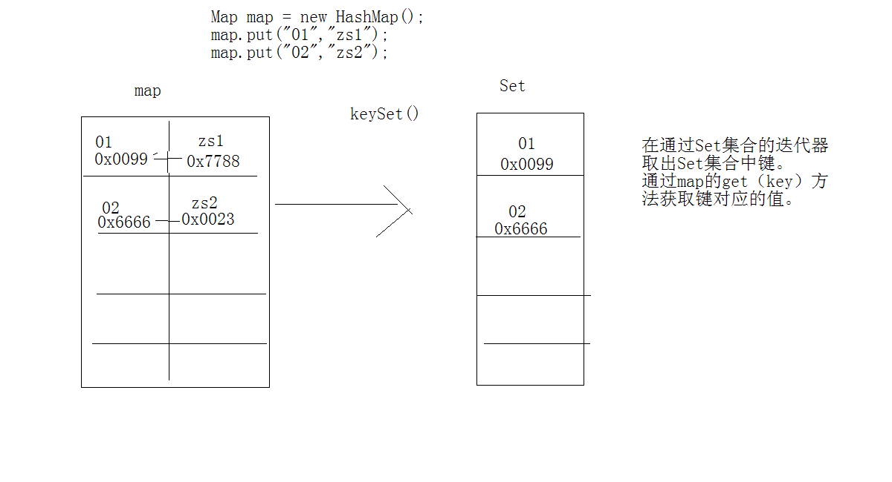
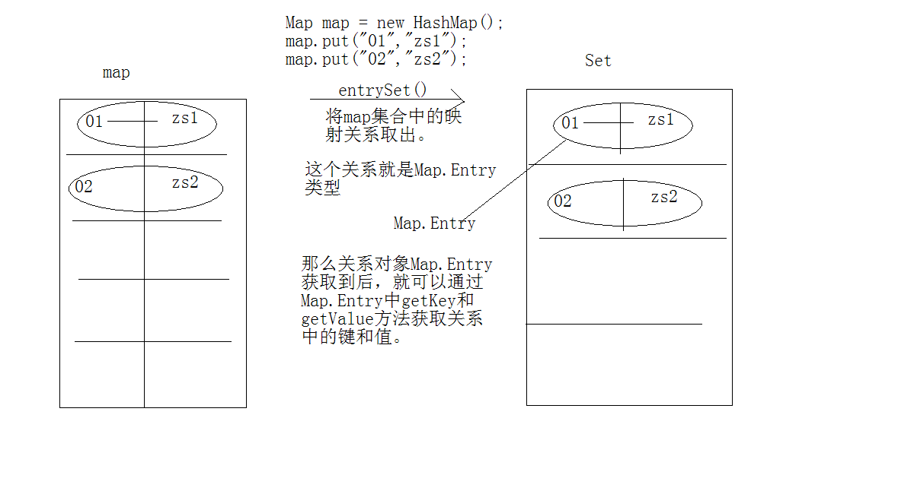

# Map

## Map集合

```java
/*
Map集合：该集合存储键值对。一对一对往里存。而且要保证键的唯一性。
	1，添加。
		put(K key, V value) 
		putAll(Map<? extends K,? extends V> m) 

	2，删除。
		clear() 
		remove(Object key) 

	3，判断。
		containsValue(Object value) 
		containsKey(Object key) 
		isEmpty() 


	4，获取。
		get(Object key) 
		size() 
		values() 

		entrySet() 
		keySet() 

Map
	|--Hashtable:底层是哈希表数据结构，不可以存入null键null值。该集合是线程同步的。jdk1.0.效率低。
	|--HashMap：底层是哈希表数据结构，允许使用 null 值和 null 键，该集合是不同步的。将hashtable替代，jdk1.2.效率高。
	|--TreeMap：底层是二叉树数据结构。线程不同步。可以用于给map集合中的键进行排序。


和Set很像。
其实大家，Set底层就是使用了Map集合。


*/
import java.util.*;
class  MapDemo
{
	public static void main(String[] args) 
	{
		Map<String,String> map = new HashMap<String,String>();

		//添加元素,添加元素，如果出现添加时，相同的键。那么后添加的值会覆盖原有键对应值。
		//并put方法会返回被覆盖的值。
		System.out.println("put:"+map.put("01","zhangsan1"));
		System.out.println("put:"+map.put("01","wnagwu"));
		map.put("02","zhangsan2");
		map.put("03","zhangsan3");

		System.out.println("containsKey:"+map.containsKey("022"));
		//System.out.println("remove:"+map.remove("02"));

		System.out.println("get:"+map.get("023"));

		map.put("04",null);
		System.out.println("get:"+map.get("04"));
		//可以通过get方法的返回值来判断一个键是否存在。通过返回null来判断。


		
		//获取map集合中所有的值。
		Collection<String> coll = map.values();

		System.out.println(coll);
		System.out.println(map);


	}
}

```

```java
package learning;

import java.util.Collection;
import java.util.HashMap;
import java.util.Iterator;
import java.util.Map;
import java.util.Set;

import javax.rmi.CORBA.Tie;

/**
 * Map 的常用操作
 * @author asdw1
 *
 */
public class TestDemo1 {

	public static void main(String[] args) {
		Map<String, String> map = new HashMap<String, String>();
		// put添加相同键的元素，会返回覆盖前的元素
		map.put("01", "Java01");
		map.put("02", "Java02");
		map.put("03", "Java03");
		map.put("04", "Java04");
		map.put("05", "Java05");
		System.out.println("containsKey: " + map.containsKey("01"));
		System.out.println("ContainsValue: " + map.containsValue("Java01"));
		
		System.out.println("get: " + map.get("04"));
		
		//获取集合中的所有元素：
		
		Collection<String> coll = map.values();
		System.out.println(coll);
		System.out.println(map);
		
		/**
		 * 获取Map集合的2种方法：
		 * 1.获取单列键集合
		 * 2.使用iterator的方法遍历该set集合
		 * 3.使用map的get方法得到所有的值
		 */
		Set<String> keySet = map.keySet();
		
		for(Iterator<String> it = keySet.iterator(); it.hasNext();) {
			String key = it.next();
			String value = map.get(key);
			
			System.out.println(key + " = " + value);
		}
		/**
		 * 获取Map集合的第二种方法：
		 * 1. 使用set集合存储Map的键值关系
		 * 2. 使用iterator遍历set集合键值关系
		 * 3. 把键值关系进行分解
		 */
		Set<Map.Entry<String, String>> entries = map.entrySet();
		Iterator<Map.Entry<String, String>> it = entries.iterator();
		
		while(it.hasNext()) {
			Map.Entry<String, String> me = it.next();
			String key = me.getKey();
			String value = me.getValue();
			System.out.println(key + " = " + value);
		}
		
	}

}
/**
 * Map.Entry其实也是一个接口 是一个内部接口
 * Interface Map {
 * 		public static Interface Entry{
 * 			public abstract Object getKey();
 * 			public abstract Object getValue();
 * 		}
 * }
 * 
 * class HashMap implements Map{
 * 
 * 		class Hass implements Map.Entry{
 * 			public abstract Object getKey(){}
 * 			public abstract Object getValue(){}
 * 		}
 * 
 * }
 * 
 */
```

第一种方法的内存：



第二种方式的内存：



综合例子：

```java
package learning;

import java.util.Comparator;
import java.util.HashMap;
import java.util.Iterator;
import java.util.Map;
import java.util.Set;
import java.util.TreeMap;

/**
 * 1. 例子：人
 * 		每一个学生都对应的归属地
 * 		年龄和姓名相同被视为同一个学生
 * 		保证学生的唯一性
 * @author asdw1
 *
 */

class MyCmp implements Comparator<Student>{
	public int compare(Student s1, Student s2) {
		return -1;
	}
}

class Student implements Comparable<Student>{
	private String name;
	private int age;
	public Student(String name, int age) {
		super();
		this.name = name;
		this.age = age;
	}
	public String getName() {
		return name;
	}
	public void setName(String name) {
		this.name = name;
	}
	public int getAge() {
		return age;
	}
	public void setAge(int age) {
		this.age = age;
	}
	
	public int hashCode() {
		return this.name.hashCode() + age * 11;
	}
	public boolean equals(Object obj){
		if(!(obj instanceof Student))
			throw new RuntimeException("类型不匹配...");
		Student s = (Student)obj;
		
		return this.name.equals(s.name) && this.age == s.age;
	}
	
	public int compareTo(Student s1) {
		int num = new Integer(this.age).compareTo(new Integer(s1.age));
		if(num == 0) {
			return this.name.compareTo(s1.name);
		}
		return num;
	}
	@Override
	public String toString() {
		return "Student [name=" + name + ", age=" + age + "]";
	}
	
}

public class TestDemo2 {

	public static void main(String[] args) {
		HashMap<Student, String> hm = new HashMap<Student, String>();
		hm.put(new Student("lisi1",21),"beijing");
		hm.put(new Student("lisi1",21),"tianjin");
		hm.put(new Student("lisi2",22),"shanghai");
		hm.put(new Student("lisi3",23),"nanjing");
		hm.put(new Student("lisi4",24),"wuhan");
		
		TreeMap<Student, String> tm = new TreeMap<Student, String>(new MyCmp());
		tm.put(new Student("lisi1",21),"beijing");
		tm.put(new Student("lisi1",21),"tianjin");
		tm.put(new Student("lisi2",22),"shanghai");
		tm.put(new Student("lisi3",23),"nanjing");
		tm.put(new Student("lisi4",24),"wuhan");
		//方法1：
		Set<Student> keySet = hm.keySet();
		Iterator<Student> it = keySet.iterator();
		while(it.hasNext()) {
			Student s = (Student)it.next();
			String addr = hm.get(s);
			System.out.println(s.toString()+".."+addr);
		}
		//方法2：
		Set<Map.Entry<Student, String>> entries = hm.entrySet();
		Iterator<Map.Entry<Student, String>> it1 = entries.iterator();
		while(it1.hasNext()) {
			Map.Entry<Student, String> me = it1.next();
			Student s = me.getKey();
			String  addr = me.getValue();
			System.out.println(s.toString()+".."+addr);
		}
		
		System.out.println(tm);
	}

}

```

## 练习

```java
package learning;

import java.util.Iterator;
import java.util.Map;
import java.util.Set;
import java.util.TreeMap;


/*
练习：
"sdfgzxcvasdfxcvdf"获取该字符串中的字母出现的次数。

希望打印结果：a(1)c(2).....

通过结果发现，每一个字母都有对应的次数。
说明字母和次数之间都有映射关系。

注意了，当发现有映射关系时，可以选择map集合。
因为map集合中存放就是映射关系。


什么使用map集合呢？
当数据之间存在这映射关系时，就要先想map集合。

思路：
1，将字符串转换成字符数组。因为要对每一个字母进行操作。

2，定义一个map集合，因为打印结果的字母有顺序，所以使用treemap集合。

3，遍历字符数组。
	将每一个字母作为键去查map集合。
	如果返回null，将该字母和1存入到map集合中。
	如果返回不是null，说明该字母在map集合已经存在并有对应次数。
	那么就获取该次数并进行自增。，然后将该字母和自增后的次数存入到map集合中。覆盖调用原理键所对应的值。

4，将map集合中的数据变成指定的字符串形式返回。


*/


public class TestDemo3 {

	public static void main(String[] args) {
		String str = "ak+abAf1c,dCkaAbc-defa";
		String s= charCount(str);
		System.out.println(s);
	}
	public static String charCount(String str) {
		char[] ch = str.toCharArray();
		TreeMap<Character, Integer> tm = new TreeMap<Character, Integer>();
		
		int count = 0;
		for(int i = 0; i < ch.length; i++) {
			if(!(ch[i] >= 'a' && ch[i] <= 'z' || ch[i] >= 'A' && ch[i] <= 'Z'))
				continue;
			Integer value = tm.get(ch[i]);
			if(value != null) {
				count = value;
			}
			count ++;
			tm.put(ch[i], count);
			count = 0;
		}
		
		StringBuilder sb = new StringBuilder();
		
		Set<Map.Entry<Character,Integer>> entrySet = tm.entrySet();
		Iterator<Map.Entry<Character,Integer>>  it = entrySet.iterator();
		while(it.hasNext())
		{
			Map.Entry<Character,Integer> me = it.next();
			Character chh = me.getKey();
			Integer value = me.getValue();
			sb.append(chh+"("+value+")");
		}
		
		return sb.toString();
	}

}

```


## Map的嵌套部分

